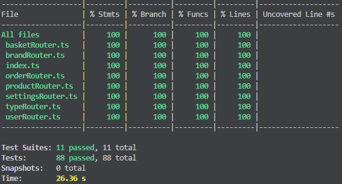

<h3 align="center">WEBSHOP [ReactJS + Express(NodeJS) + Sequalize(PostgreSQL)]</h3>

## 📝 Quick links

- [About](#about)
- [Getting Started](#getting_started)
- [Usage](#usage)
- [Tech Stack](#techstack)
- [Tests](#tests)
- [Screenshots](https://github.com/alexromlex/NODE_REACT_webshop/tree/main/screenshots)

## 🧐 About <a name = "about"></a>

This project was published only for code demonstrating. It has limited e-commerce functionality of following features.

| User                   | Admin                       |
| ---------------------- | --------------------------- |
| - Registration / login | - Dashboard with statistics |
| - Product Items        | - Orders                    |
| - Basket management    | - Users                     |
| - Checkout process     | - Products                  |
|                        | - Product types             |
|                        | - Brands                    |
|                        | - Settings                  |

## 🏁 Getting Started <a name = "getting_started"></a>

These instructions will get you a copy of the project up and running on your local machine for development and testing purposes.

### Installing

Firstly [download](https://github.com/alexromlex/NODE_REACT_webshop/archive/refs/heads/main.zip) and unpack files to local storage.

Install node_modules inside \server> and \client> directories:

```
npm install
```

Run [docker desktop](https://www.docker.com/products/docker-desktop/)

Then, run all containers with command from project root dicrectory:

```
docker compose up -d
```

I recommend create database by API, but before waiting for container <webshop_db> to start successfully, see docker desktop app!

<webshop_db> container logs must be like:

```
LOG: database system is ready to accept connections
```

Also you'll see db files inside project root directory \db>

Then, go to URL: http://localhost:5026/api/system/db_sync

itt will run:

- db authentication
- create db tables
- create admin user
- create default settings

## 🎈 Usage <a name="usage"></a>

Firstly login as ADMIN by URL: http://localhost:5226/login

ADMIN email & password you can find inside root directory .env file

Then, go to admin panel http://localhost:5226/admin/brands where you can create a brands!

After this, create product types, that will contain the brands you have already created.

When you have types and brands, let's crate a products!

## 🚀 Tech Stack <a name = "techstack"></a>

## Backend

- NodeJS v.18
- Express v.4
- Loging - Morgan
- Authentication (JWT + bcrypt)
- TypeScrypt

## Database

- Sequalize v.6 ORM
- PostgreSQL v.16
- pgadmin v.4 (included)

## Frontend

- ReactJS
- HighCharts
- TinyMCE
- TypeScrypt

## Tests

- Jest
- Supertest
- TypeScrypt

## 🔧 Running the tests <a name = "tests"></a>

To start tests, run CMD in \server> directory :

```
 npm run test
```

Tests written for API router with 100% coverage:


